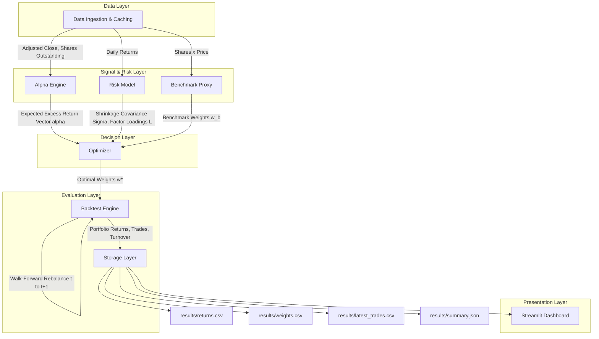

# Enhanced Indexing: Nifty 50 Portfolio Optimization

[](.github/workflows/ci.yml)
[](pyproject.toml)
[](pyproject.toml)
[](LICENSE)

---

## ⚠️ Disclaimer

**This repository is strictly for research and academic purposes.** It is a demonstration of systematic portfolio construction, convex optimization, and quantitative risk modeling techniques applied to a public equity index. **Nothing in this repository constitutes investment advice, a recommendation, or a solicitation to buy or sell any security.** Backtested performance is hypothetical, does not reflect actual trading, and is not indicative of future results. The authors accept no liability for any use of this code in a live trading context. Consult a licensed financial advisor before making investment decisions.

---

## 1. Project Overview

**Enhanced Indexing** is a systematic quantitative strategy applied to the **Nifty 50** universe. The objective is to construct a portfolio that:

- Seeks **positive excess return (alpha)** relative to a market-cap-weighted benchmark proxy, using transparent, price-only signals.
- Maintains **tight active risk**, bounded by explicit constraints on **annualized tracking error**, **single-stock active weight**, and **sector active weight**.
- Controls **transaction costs and turnover** through an explicit cost penalty and a hard turnover cap, enforced via a graduated constraint-relaxation fallback ladder.
- Is implemented end-to-end as a **convex optimization problem** (CVXPY + CLARABEL), not a heuristic screen-and-rank approach, so that every reported weight is the certified solution (or documented relaxation) of a well-posed QP.

The strategy is designed around **strict point-in-time discipline**: every signal computed using data available at the close of day *t* is only ever executed at the close of day *t+1*, eliminating a large class of look-ahead bias by construction.

---

## 2. Architecture & Pipeline



### 2.1 Data Ingestion & Caching

- Downloads **adjusted close prices** and **shares outstanding** for all Nifty 50 constituents via `yfinance`, using `.NS`-suffixed tickers (NSE listings).
- All pulls are **cached to Parquet** with a **1-day TTL**, avoiding redundant network calls on repeated runs within the same trading day.
- On network or ticker-resolution failure, the pipeline **falls back to `data/static_sectors.csv`** for sector classification and the last successfully cached price panel, so a transient API outage does not halt the pipeline.

### 2.2 Alpha Engine

Three **price-only** cross-sectional factors are computed per stock:

| Factor | Definition | Rationale |
|---|---|---|
| **12-1 Momentum** | 12-month return, skipping the most recent month | Captures intermediate-term trend while avoiding 1-month reversal contamination |
| **60-day Low Volatility** | Inverse of trailing 60-day realized volatility | Rewards stable names; low-vol anomaly |
| **1-Month Reversal** | Negative of trailing 1-month return | Captures short-term mean reversion |

Processing pipeline per factor:

1. **Winsorize** at the 1st and 99th percentiles (cross-sectionally, per rebalance date) to suppress outlier distortion.
2. **Cross-sectionally z-score** each factor independently.
3. **Combine** with fixed weights: `0.40 * Momentum + 0.30 * LowVol + 0.30 * Reversal`.
4. **Re-z-score** the composite signal cross-sectionally.
5. **Scale to expected excess return** using an Information Coefficient (IC) mapping:

$$alpha_i = IC \times \text{annual\_vol}_i \times z_i \quad \text{where } IC = 0.05$$

This maps a unitless composite z-score into an **economically interpretable expected excess return**, scaled by each stock's own annualized volatility so that riskier names are not automatically assigned proportionally larger alpha purely as an artifact of the z-score.

### 2.3 Risk Model

- **Ledoit-Wolf shrinkage covariance** estimated on daily returns, annualized via `x252`.
- The resulting covariance matrix is **symmetrized** (`Sigma = (Sigma + Sigma.T) / 2`) to eliminate floating-point asymmetry.
- **Eigenvalue-floored** at `>= 1e-8` to guarantee **positive semi-definiteness (PSD)** — any eigenvalue below the floor is clipped before the matrix is reconstructed, which is a hard numerical requirement for the optimizer's quadratic form to remain convex.
- A **factor decomposition `Sigma = L @ L.T`** (Cholesky-style) is computed once per rebalance and passed into CVXPY, so the tracking-error penalty and constraint are expressed as `||L.T @ a||^2` — a DCP-compliant convex quadratic form, avoiding the need to pass the dense covariance matrix directly into the solver.

### 2.4 Optimizer

Implemented as a convex program via **CVXPY**, solved with the **CLARABEL** interior-point solver.

**Objective** (maximize):

$$\alpha^T a - \lambda \Vert{} L^T a \Vert{}_2^2 - \text{cost\_bps} \cdot \Vert{} w - w_{\text{prev}} \Vert{}_1$$

where $a = w - w_b$ is the **active weight vector** (portfolio minus benchmark).

**Constraints:**

| Constraint | Specification |
|---|---|
| Full investment | $\sum w_i = 1$ |
| Long-only | $w \ge 0$ |
| Single-stock active limit | $\Vert{}w_i - w_{b,i}\Vert{} \le 2\%$ for all $i$ |
| Sector active limit | $\Vert{}\sum_{i \in S} w_i - \sum_{i \in S} w_{b,i}\Vert{} \le 3\%$ per sector $S$ |
| Tracking error (annualized) | $\sqrt{a^T \Sigma a} \le 3\%$ |
| Turnover (one-way) | $0.5 \cdot \Vert{}w - w_{\text{prev}}\Vert{}_1 \le 20\%$ |

**Fallback Ladder** — if the base problem is infeasible, constraints are progressively relaxed and re-solved, in order, until a feasible solution is found:

1. Relax turnover limit **×2** (20% → 40%)
2. Relax sector active limit **×1.5** (3% → 4.5%)
3. **Fallback to benchmark weights** ($w = w_b$) as the terminal, always-feasible solution

Every relaxation step is logged, so backtest output always records whether a given rebalance date used the base problem or a relaxed/fallback tier.

### 2.5 Backtest Engine

- **Walk-forward, month-end rebalancing**, requiring a minimum of **504 trading days** (~2 years) of history before the first rebalance is attempted.
- **Strict point-in-time execution**: signals and the risk model are computed using data available at the close of day $t$; the resulting optimal weights are only **executed at the close of day $t+1$**.
- **10 bps transaction friction** applied to turnover at each rebalance, deducted directly from realized portfolio returns.
- Between rebalance dates, **portfolio weights drift** with realized daily returns (no synthetic daily re-optimization), reflecting how a real portfolio's weights evolve passively intra-month.

### 2.6 Storage & Dashboard

Each backtest run writes the following artifacts to `results/`:

| File | Contents |
|---|---|
| `returns.csv` | Daily portfolio vs. benchmark returns, active return series |
| `weights.csv` | Full weight history by rebalance date and ticker |
| `latest_trades.csv` | Most recent rebalance's trade list (buys/sells, delta weights) |
| `summary.json` | Headline performance and risk statistics (see §6) |

Results are visualized via a **Streamlit dashboard** (`app/streamlit_app.py`), providing interactive equity curves, active weight breakdowns, sector exposure charts, and turnover/cost diagnostics.

---

## 3. Core Decisions & Limitations

> **These are explicit, documented design trade-offs — not oversights. Read before interpreting any backtest result.**

### 3.1 Survivorship Bias
The strategy uses the **current** Nifty 50 constituent list (fetched live via `yfinance`), not the historical, point-in-time index membership. Stocks that were removed from the index during the backtest window (due to delisting, demotion, or acquisition) are **not** included, which biases historical performance upward relative to a true point-in-time replication.

### 3.2 Benchmark Proxy
No licensed, official Nifty 50 index level series is used. Instead, the benchmark is **reconstructed as a market-cap proxy**:

$$w_{b,i}(t) = \frac{\text{shares\_outstanding}_i \times P_i(t)}{\sum_j (\text{shares\_outstanding}_j \times P_j(t))}$$

This uses **current** shares outstanding applied retroactively to historical prices (not point-in-time share counts), but is **internally consistent**: the same benchmark weight series used for performance comparison is also the exact $w_b$ used in the tracking-error and active-weight constraints inside the optimizer, so the reported tracking error is accurate *relative to this proxy*, even though the proxy itself is an approximation of the true free-float index.

### 3.3 Price-Only Alpha (No Fundamentals)
Fundamental factors (valuation, quality, earnings revisions, etc.) are **deliberately excluded**. Point-in-time fundamental datasets with verified, un-revised filing dates are not freely available for this universe; using current fundamentals applied to historical dates would introduce **silent look-ahead bias** that is far harder to detect than a price-data error. All three alpha factors are derived purely from historical price/volume, which is unambiguously point-in-time by construction.

### 3.4 Strict Point-in-Time Execution
Signals computed from data as of day $t$'s close are **never** executed at day $t$'s close — only at day $t+1$'s close. This one-day execution lag is enforced structurally in the backtest engine, not as a post-hoc adjustment, and is the primary defense against look-ahead bias in the signal-to-execution path.

---

## 4. Repository Structure

```text
enhanced-indexing-nifty50/
├── src/
│   └── eindex/
│       ├── __init__.py
│       ├── config.py          # Config loading, validation (config.yaml schema)
│       ├── data.py            # yfinance ingestion, Parquet caching, static fallback
│       ├── signals.py         # Momentum / low-vol / reversal factor computation
│       ├── risk.py            # Ledoit-Wolf covariance, PSD floor, factor decomposition
│       ├── optimizer.py       # CVXPY problem definition, fallback ladder
│       ├── backtest.py        # Walk-forward rebalancing, turnover, cost application
│       ├── analytics.py       # Performance/risk statistics, summary.json generation
│       └── pipeline.py        # End-to-end orchestration (CLI entry point)
├── tests/
│   ├── test_config.py
│   ├── test_data.py
│   ├── test_signals.py
│   ├── test_risk.py
│   ├── test_optimizer.py
│   ├── test_backtest.py
│   └── test_app.py
├── app/
│   └── streamlit_app.py       # Interactive dashboard
├── data/
│   ├── cache/                 # Parquet-cached price/shares panels (1-day TTL)
│   └── static_sectors.csv     # Sector classification fallback
├── results/
│   ├── returns.csv
│   ├── weights.csv
│   ├── latest_trades.csv
│   └── summary.json
├── .github/
│   └── workflows/
│       ├── ci.yml             # Lint + test on push/PR
│       └── rebalance.yml      # Scheduled monthly rebalance run
├── config.yaml                # Strategy parameters (IC, lambda, limits, cost_bps, etc.)
├── pyproject.toml             # Package metadata, Ruff config
├── requirements.txt
├── CONTEXT.md                 # Design rationale and decision log
├── LICENSE
└── README.md

---

## 5. Setup & Usage

### 5.1 Prerequisites
- **Python 3.12**
- **Git**

### 5.2 Installation

```bash
python3.12 -m venv .venv && source .venv/bin/activate
pip install -r requirements.txt
pip install -e .
```

### 5.3 Testing & Linting

```bash
ruff check .
pytest -q
```

### 5.4 Run the Pipeline

```bash
python -m eindex.pipeline
```

This executes the full chain: data ingestion → alpha computation → risk model → optimization → walk-forward backtest → artifact export to `results/`.

### 5.5 Launch the Dashboard

```bash
streamlit run app/streamlit_app.py
```

---

## 6. Testing & Mathematical Integrity

The test suite is designed to catch **silent correctness failures**, not just runtime exceptions:

| Guarantee | Test Focus |
|---|---|
| **Look-ahead bias immunity** | Asserts that signal values computed at day *t* are bitwise-identical regardless of what data exists beyond day *t+1* in the input panel, and that execution timestamps are always strictly `t+1 >= signal_date`. |
| **PSD eigenvalue floor validation** | Constructs adversarial near-singular and intentionally indefinite covariance inputs and asserts all eigenvalues of the output `Sigma` are `>= 1e-8`, and that `L @ L.T` reconstructs `Sigma` within numerical tolerance. |
| **Constraint satisfaction** | For every solved (or relaxed) optimization result, asserts `sum(w) == 1` (within tolerance), `w >= 0`, active stock/sector bounds, tracking error, and turnover are all simultaneously respected for the returned weight vector. |
| **Fallback ladder coverage** | Explicitly constructs infeasible constraint sets at each tier (base, turnover-relaxed, sector-relaxed, benchmark-fallback) and asserts the optimizer escalates through the ladder in the correct order and terminates at the benchmark-weight solution as the guaranteed-feasible floor. |

CI (`.github/workflows/ci.yml`) runs `ruff check .` and `pytest -q` on every push and pull request. `.github/workflows/rebalance.yml` runs the full pipeline on a scheduled monthly cadence to regenerate `results/` artifacts.

---

## License

Distributed under the [MIT License](LICENSE).